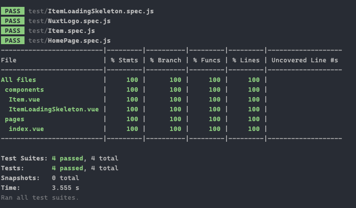
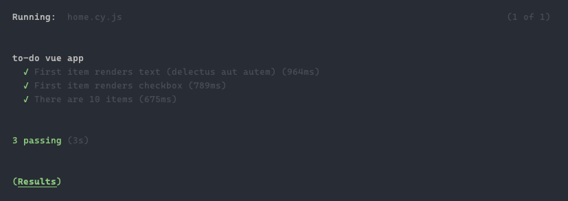
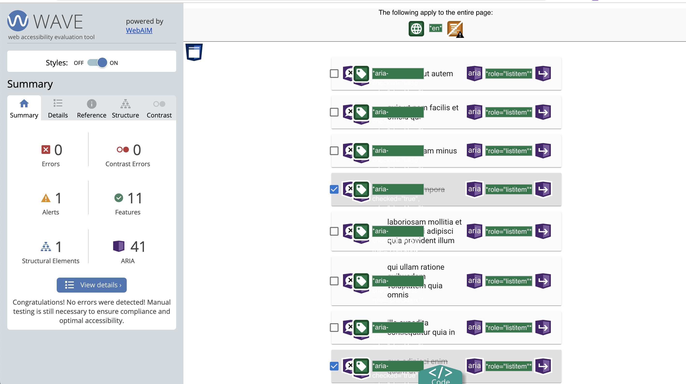

# Andres Campuzano Garzon - Frontend Challenge

## Networking/Debugging

### External domains called

There are 13 external vendor domains being called:

* Google Tag Manager
* Google Analytics
* Google Fonts
* LogRocket
* Calendly
* Fullstory
* ClickCease
* Facebook Pixel
* ads.linkedin.com
* Bing.com | Microsoft Advertising
* Amazon s3
* reCaptcha

### `Content-Type` headers in POST request of the initial page load

There are three content-type POST requests:

* Fullstory
  * content-type: application/json; charset=utf-8
* Google Analytics
  * content-type: text/plain
* Google Marketing Platform
  * content-type: text/plain


However, from the initial page load and some seconds later inside a loop, there is a POST request that tracks last activity from the user:

* Fullstory
  * content-type: text/plain

### Major JS framework used

Nuxt.JS is the biggest JS framework in production, with a bundle size of 91.6 bk.

### Definition for given JSON response

```typescript
interface CHALLENGE_INTERFACE {
  securities: {
    unofficial_currency_code: null
    cusip: string
    ticker_symbol: string
    institution_security_id: undefined
    close_price_as_of: string
    sedol: undefined
    type: string
    institution_id: string
    close_price: number
    proxy_security_id: null
    name: string
    iso_currency_code: string
    id: string
    is_cash_equivalent: boolean
    isin: string
  }[]
  holdings: {
    cost_basis: number
    unofficial_currency_code: null | string
    institution_price: number
    account_id: string
    quantity: number
    iso_currency_code: string
    institution_price_as_of: string
    security_id: string
    institution_value?: number
    evaluated?: boolean
  }[]
}
```


## Code Challenge

```bash
# clone repo

# install dependencies
$ npm install

# serve with hot reload at localhost:3000
$ npm run dev
```

### Jest tests

```bash
# run jest
$ npm run test:jest
```

You'll see something like this:



### e2e Cypress tests

```bash
# run cypress - make sure you have a dev server running, if not, 'npm run dev' first
$ npm run test:cypress
```

You'll see something like this:



### A11y (Accessibility)

Test were made using Wave tool, page can be used with screen readers.


